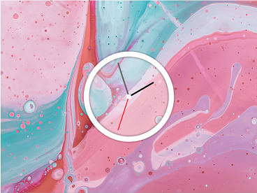

# JavaScript30 - Day 2

Hello!!!:wave:

:woman_technologist: Here is **Day-2 of JavaScript30**, following step by step the tutorial, but I have made a few little changes.

:computer: [JavaScript 30](https://javascript30.com/ "JavaScript 30") is a 30 Day Vanilla JS Coding Challenge

:x: No Frameworks / No Compilers / No Libraries

## Screenshot

## Live site

- [Day-2/30](https://melissavi08.github.io/javascript-30/day-2/index.html)

## Connect with me

 
