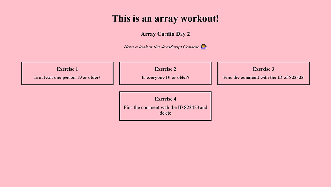

# JavaScript30 - Day 7

Hi, there:wave:

:woman_technologist: Here is **Day-7 of JavaScript30**, following step by step the tutorial. In this version, I have added some HTML and CSS.

:computer: [JavaScript 30](https://javascript30.com/) is a 30 Day Vanilla JS Coding Challenge

:x: No Frameworks / No Compilers / No Libraries

## Screenshot

## Live site

- [Day-7/30](https://melissavi08.github.io/javascript-30/day-7/index.html)

## Connect with me

 
